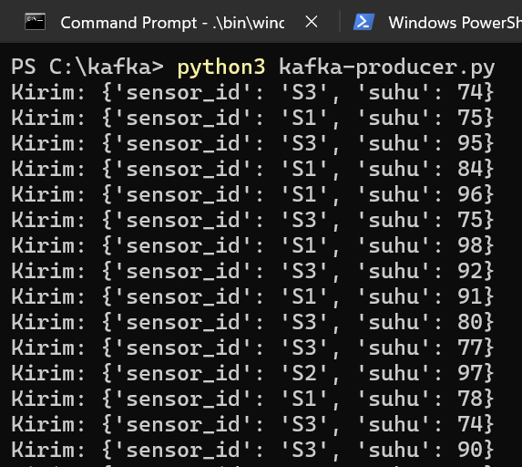
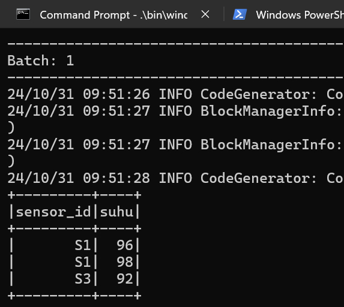

# not-simple-kafka-bigdata

| Nama Lengkap              | NRP           |
| :-----------------------: | :-----------: |
| Gabriella Erlinda Wijaya  | 5027221018    |
| Michael Wayne             | 5027221037    |

## Instalasi Java, Apache Spark, Hadoop, dan Kafka

### Instalasi Java 11
1. *Download* Java versi 11 melelalui https://adoptium.net/temurin/releases/?version=11, lalu *extract*
2. Pada ```C:\Program Files```, buat *folder* baru bernama **OpenJDK**
3. *Copy folder* **jdk-11.0.25+9** dari ```Downloads\OpenJDK11U-jdk_x64_windows_hotspot_11.0.25_9```, lalu *paste* ke dalam *folder* ```C:\Program Files\OpenJDK```
4. Atur Java ke dalam *environment variable* pada Windows
6. Buat System Variable baru, beri nama *variable name*: JAVA_HOME dan *variable value*: ```C:\Program Files\OpenJDK\jdk-11.0.25+9```. Setelah itu, klik OK 
7. Pada *section* System Variable, klik Path dan buat *path* baru bernama ```%JAVA_HOME%\bin```. Setelah itu, klik OK

```
C:\Program Files\OpenJDK\jdk-11.0.25+9
bin/  conf/  include/  jmods/  legal/  lib/  NOTICE  release
```

### Instalasi Apahe Spark 3.5.3
1. *Download* Apache Spark versi 3.5.3 melelalui https://spark.apache.org/downloads.html, lalu *extract*
2. Pada ```C:\```, buat *folder* baru bernama **spark**
3. *Copy* semua *file* di dalam *folder* ```Downloads\spark-3.5.3-bin-hadoop3```, lalu *paste* ke dalam *folder* ```C:\spark```
4. Atur Spark ke dalam *environment variable* pada Windows
6. Buat System Variable baru, beri nama *variable name*: SPARK_HOME dan *variable value*: ```C:\spark```. Setelah itu, klik OK 
7. Pada *section* System Variable, klik Path dan buat *path* baru bernama ```%SPARK_HOME%\bin```. Setelah itu, klik OK

```
C:\spark
bin/  conf/  data/  examples/  jars/  kubernetes/  LICENSE  licenses/  NOTICE  python/  R/  README.md  RELEASE  sbin/  yarn/
```

### Instalasi Hadoop 3.3.0
1. Lakukan ```git clone https://github.com/kontext-tech/winutils/```, lalu pilih *folder* **hadoop-3.3.0**
2. Pada ```C:\```, buat *folder* baru bernama **hadoop**
3. *Copy folder* **bin** dari ```Downloads\winutils\hadoop-3.3.0```, lalu *paste* ke dalam *folder* ```C:\hadoop```
4. Atur Hadoop ke dalam *environment variable* pada Windows
6. Buat System Variable baru, beri nama *variable name*: HADOOP_HOME dan *variable value*: ```C:\hadoop```. Setelah itu, klik OK 
7. Pada *section* System Variable, klik Path dan buat *path* baru bernama ```%HADOOP_HOME%\bin```. Setelah itu, klik OK

```
C:\hadoop\bin
hadoop.dll*  hadoop.exp  hadoop.lib  hadoop.pdb  libwinutils.lib  winutils.exe*  winutils.pdb
```

### Instalasi Kafka
Ikuti video tutorial dari YouTube: https://youtu.be/BwYFuhVhshI?si=OLCHLZ9Nj6TtDH9-

## Run Program
1. Setelah Kafka berhasil *diinstall*, *copy-paste file* [kafka-producer.py](./kafka-producer.py) dan [kafka-producer.py](./kafka-producer.py) ke dalam *folder* ```C:\kafka```
2. Pada ```C:\kafka```, jalankan ```.\bin\windows\zookeeper-server-start.bat .\config\zookeeper.properties```
3. Buka *tab* baru, pada ```C:\kafka```, jalankan ```.\bin\windows\kafka-server-start.bat .\config\server.properties```
4. Buka *tab* baru, pada ```C:\kafka```, jalankan ```python3 kafka-producer.py```
5. Buka *tab* baru, pada ```C:\kafka```, jalankan ```spark-submit --packages org.apache.spark:spark-sql-kafka-0-10_2.12:3.5.3 .\spark-consumer.py```

```
C:\kafka
│   kafka-producer.py
│   LICENSE
│   NOTICE
│   spark-consumer.py
├───bin
├───config
├───kafka-logs
├───libs
├───licenses
├───logs
├───site-docs
├───temp
└───zookeeper-data
```

## Dokumentasi Hasil Pengerjaan

Pada producer <br />


Pada consumer <br />

